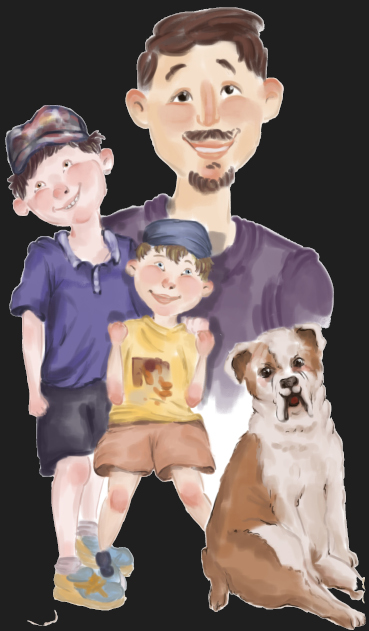

# Technical and Instructional Content Samples

Hi, my name's Brian. Thanks for stopping by to review some of my professional writing samples. I've been writing, technically, since 2005. I've worked on a number of technical writing projects, from healthcare IT products, to home design software, to a smart building product. I’ve even delivered pizza (which, ironically, was the topic of my first technical writing project while in college). Below are samples of help topics I've written and video tutorials I've produced. 

- [Writing Samples](#writing-samples)
- [Video Samples](#video-samples)

I've also experimented with some creative writing - I've self published four children's books written by my sons. You can see this work here: **[Herald and Sons Books](http://www.heraldandsons.com)**.

These projects involved a lot of organization, preparation, and overall project management. They involved working with an illustrator (vetting and hiring the right person, providing detailed sceen descriptions and approving sketches and drafts), formatting and layout for the print and e-books, working with a narrator to produce the audio, and then marketing to position each story properly. Finally, coordinating with the various retailers for selling the audio, e-book, and print versions. 

## Writing Samples
Below are some samples of topics I've been resposible for authoring. The majority are about healthcare IT products, but I've also sprinkled in a Tenant Guide for a smart building product. 

Jump to: 

[End User Help Topic (healthcare IT product)](#end-user-help-topic-healthcare-it-product) | [Administrator Help Topic (healthcare IT product)](#administrator-help-topic-healthcare-it-product) | [Quick Reference Documents (healthcare IT product)](#quick-reference-documents-healthcare-it-product) | [End User Guide (smart building integration product)](#end-user-guide-smart-building-integration-product)

### End User Help Topic (healthcare IT product)
This topic titled "Communicating with a Patient's Care Team in PK Messaging" describes chat functionality available within the PatientKeeper app that allows a physician to communicate with a patient's care team. 

I've included this topic because it's a complex feature that applies to only specific types of users in a specific scenario, so it was a challenging topic to create. This functionality also depends on system configurations, which are referenced from within this topic. I worked very closely with the Product Manager and software engineer to ensure the content was accurate, and I feel like this is a good example of concise end-user content. 

*Note that I've only included the files needed to view this topic so links to other topics in the help system do not work.*

**[User Help sample](https://mydogjack.github.io/samples/UserTopicSample-Web/index.html)**

### Administrator Help Topic (healthcare IT product)
This help topic titled "MHB Care Team Integration" describes configuration settings to enable chat functionality between a physician and a patient's care team. These configuration settings enable communication between a chat module built into the PatientKeeper browser and a third-party app on another mobile device.  

I've included this topic because I feel it is a good example of a complicated configuration that has been simplified and can make sense to even a novice administrator. The topic provides context and references to other pages where additional information exists. I worked very closely with the Product Manager on this topic to ensure it was accurate and easy for end users to understand. 

*Note that I've only included the files needed to view this topic so links to other topics in the help system do not work.*

**[Admin Help sample](https://mydogjack.github.io/samples/AdminTopicSample/)**

### Quick Reference Documents (healthcare IT product)
Another type of deliverable I helped create came out of end user's desire to have a printable document with details all on one page. These are referred to as Quick Reference Cards. These documents are intended to provide enough information on one page for a user to complete a task. These were produced for the Web app, Apple app, and Android app. Below are examples of a quick reference for each platform that describes a clinical note creating module (known as NoteWriter). I've also included some Quick References for other clinical modules and workflows. 

**[Clinical Notes on the Web App - Quick Reference](https://mydogjack.github.io/samples/qrc/notewriter_ref_card.pdf)**

**[Clinical Notes on the Apple App - Quick Reference](https://mydogjack.github.io/samples/qrc/mobile_clinical_notes_apple_ref_card.pdf)**

**[Clinical Notes on the Android App - Quick Reference](https://mydogjack.github.io/samples/qrc/mobile_clinical_notes_android_ref_card.pdf)**

**[Admission Medication Reconciliation on the Web - Quick Reference](https://mydogjack.github.io/samples/qrc/admission_med_rec_ref_card.pdf)**

**[Medication Reconciliation for Emergency Department on the Web - Quick Reference](https://mydogjack.github.io/samples/qrc/med_rec_for_ED_ref_card.pdf)**

**[Discharge Medication Reconciliation on the Web - Quick Reference](https://mydogjack.github.io/samples/qrc/discharge_med_rec_ref_card.pdf)**

**[Discharge Medication Reconciliation with Electronic Prescriptions on the Web - Quick Reference](https://mydogjack.github.io/samples/qrc/discharge_med_rec_erx_ref_card.pdf)**

### End User Guide (smart building integration product)
This user guide was created to describe a a product that integrates with systems inside a smart building. Using the product, tenants could call an elevator, gain access to areas where they are allowed access, control their local temperature, and more.
To create this guide, I designed a reusable template, and incorporated both web-based and mobile functionality. Two other variations of this guide were created for additional roles with more access and control over administering the system.  

**[Tenant User Guide sample](https://mydogjack.github.io/samples/cohesion/QuickStartGuide_Tenant.pdf)**

## Video Samples
Below you'll find a couple of examples of tutorial videos I have created. Both of these videos cover the same topic (starting a conversation using the PK Messaging module), but one was produced for the web app help system and the other was produced for the Apple (iPhone) help system. 

For each video, I wrote the script with input from Product Management, captured the screens using Adobe Captivate, recorded the audio, and then edited and produced the output as HTML5 so it could be embedded in our help system. 

**[Web App Video Sample](https://mydogjack.github.io/samples/pkmsg_1startconvo/)**

**[Apple App Video Sample](https://mydogjack.github.io/samples/apple_pkmsg_startconvo/)**

### NoteWriter on Android Videos
Here is a video sample for the NoteWriter module on Android devices.

**[NoteWriter on Android - Tour](https://mydogjack.github.io/samples/android_nw_tour/)**
